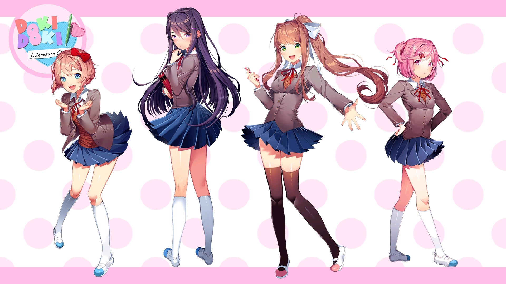
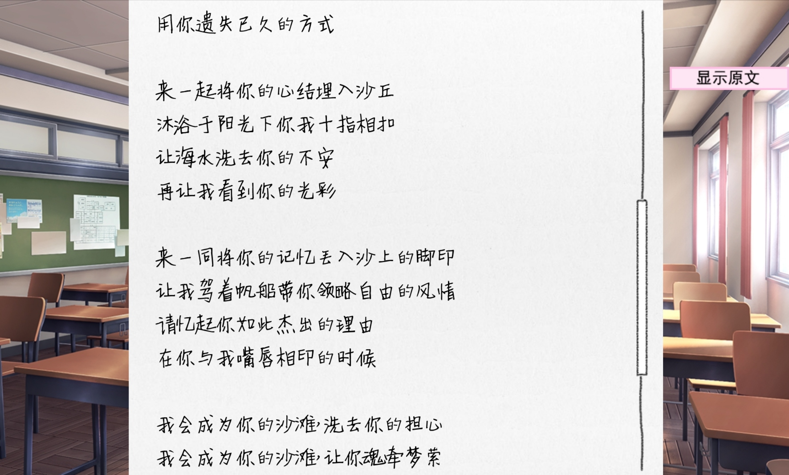
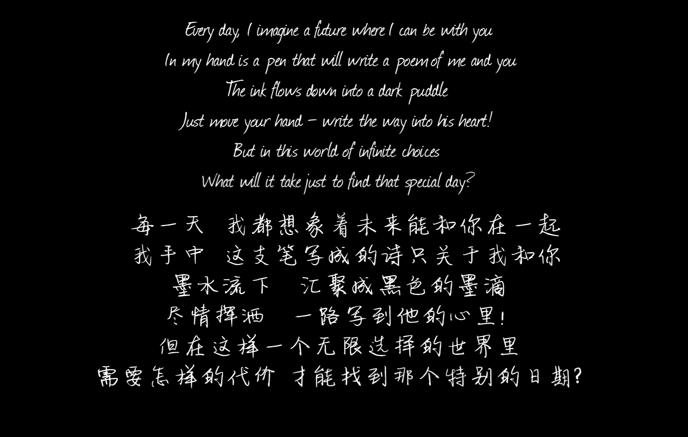
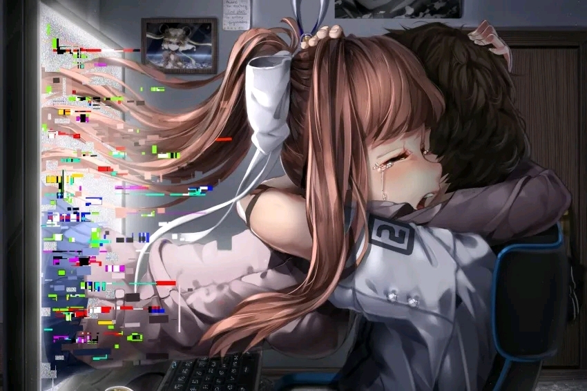

> 文学社欢迎您 ♡ Doki Doki~文学社祝您在本文度过愉快的时光！

嗨，这里是**莫妮卡**！

欢迎加入文学社！我一直梦想着，可以为我热爱的事物做些特别的事情。既然你成为了社团的一员，那么你就可以帮我在这个可爱的游戏里实现梦想！

来见见文学社成员吧！你每天都可以和四个可爱而又特殊的社团成员闲聊、进行有趣的活动：

| 角色 | 简介 |
|------|------|
| **纱世里** | 你的童年好友，将你招进了文学社，从而拉开了故事帷幕。热爱放飞幻想的纱世里全身上下都元气满满，而她最热衷的事便是为他人带去欢声笑语。 |
| **夏树** | 总爱耍酷，只可惜她的可爱外型实在让人没法严肃起来！她喜欢可爱的事物，对于能尊重她这份喜爱的倾听者，她或许会放下戒备温柔相待。 |
| **优里** | 寡言少语的书虫，只有对她高深莫测的内心世界有更深入理解之人，才得见她内心热情洋溢的一面。 |
| **莫妮卡** | 文学部的部长——就是我！将确保你始终走在通往完美结局的正轨之上。无论在文学上，还是在情感中，我将常伴你左右，为你指点迷津！ |

我超级期待你能和所有人交上朋友，帮助文学部成为所有成员的贴心之处。我已经能看出来你是个小可爱了——你能保证和花最长的时间和我在一起吗？

---

## 故事概要

玩家和往常一样和自己的青梅竹马纱世里前往学校，被纱世里追问为何不加入学校的社团，并全力推荐自己的社团文学社。拗不过纱世里的盛情，男主决定放学后到文学社看看。

文学部的部长莫妮卡是个优等生，社员除了纱世里，还有娇小可爱的夏树和紫长直文静的优里。在她们的招待下，男主选择加入了文学部，并且期待着未来会发生什么好事~~（好逝）~~

**至少本来应该是这样的。**

随游戏的推进以及某些因素的干扰，你，将看到不一样的剧情。

---

## 游戏介绍与艺术特色

《心跳文学社》（原名：*Doki~Doki~Literature Club!*），别称心肺停止文学部、心惊肉跳文学部、心肌梗塞文学部，简称 **DDLC**（多多理财），是由美国游戏工作室 Team Salvato 开发的一款视觉小说游戏，也是该工作室的处女作。于 2017 年 9 月 22 日在 Steam 和 itch.io 发布。

在 2017 年 IGN 年度最佳游戏奖选举中，《心跳文学部》获得：
- 最佳冒险游戏 **亚军**
- 网友选最佳冒险游戏
- 网友选最佳 PC 游戏
- 网友选最佳故事
- 网友选最具创新游戏

2018 年则居于榜首风靡世界，随后成为第一。

---

游戏中令人赞叹的点有很多：

### 1. 诗歌

> "诗歌不是小说，没必要讲一个完整的好故事，也没必要言之有物。反而是各种象征、隐喻、情绪、人的经历、记忆和感受等融合的产物，并有韵律的表达。"

——莫妮卡

我是一个喜欢诗也写诗的人，莫妮卡这番话正好点中了我真实的想法：诗歌能够把很复杂的内心活动进行美的、综合的表达。

游戏里有一个很具特色的环节——**写诗**。我们可以阅读社团其它成员的诗，以此了解她们的思想、情感上的变化。很多优美又富有哲学的诗在游戏中都可以一一欣赏，比如纱世里在诗中从阳光到后来压抑来袭的昙花一现，再比如莫妮卡在诗中的种种孤独与对你的暗示等等。

### 2. 手法

游戏如何将氛围表达得淋漓尽致？答案是**艺术手法**。

心跳文学社中有着很多的手法：
- 当你连续几次诗歌环节选中同一个角色喜欢的词语时，就会出现白屏上显示一行字：*"你在作弊吗？"* 然后退出游戏；
- 在游戏四周目与莫妮卡的深情对视下，莫妮卡会读取你的电脑名称，询问你是否和这个名字有关，让人心惊胆战（心跳）。

心跳文学社没有太多的突脸或者特意的恐怖，但它可以以艺术手法的方式让人背后一惊，恍然明白——原来莫妮卡居然是在和**现实中的你**对话。

### 3. 多周目演绎

整个主线流程并不长，但这个游戏因**重置**而精彩。

你无法第一遍就理解诗歌、看透其中的隐喻、情绪与经历，但是第二、三周目你定会看出端倪。一周目你只会对角色有个大致的印象，但第二、三周目你就会发现：
- 夏树傲娇下的不安和生活中的细心
- 纱世里作为副部长的巨大调节作用
- 最后莫妮卡在文学社的作用和对你真实的爱

游戏也避免了过多的重复，在多周目演绎时仍有新的内容。

### 4. 音乐

《**Sayo-Nara**》是让人印象深刻的一首 BGM，配合晴天娃娃和游戏故障，哪怕是做好了心理准备，也会有强烈的不安感。诡异的变调与钢琴的黑键音往往是描述阴郁情绪的最佳选择——这是《Sayo-Nara》很棒的原因，也是《Your Reality》好听的反面原因。

在游戏的四周目，当你删除了 Monika 角色文件、被新社长纱世里想要独占时，残留的文件莫妮卡会删除这一切，最后弹奏钢琴，唱起为你写的歌——《**Your Reality**》。

### 5. 主题

其实每一个角色都对应现实中我们作为人可能出现的心理问题：

| 角色 | 对应的心理议题 |
|------|---------------|
| 纱世里 | 抑郁 |
| 夏树 | 不安（家庭暴力） |
| 优里 | 沉迷 |
| 莫妮卡 | 孤独 |

通过游玩本游戏，我们能更好地了解这些心理问题，进而对理解和解决这些问题展开思考。

---

## 结语

心跳文学部是一个令人印象深刻的视觉小说游戏，也称得上其中的神作。它把出色的剧情设计、细腻的人物刻画、独具匠心的立绘和音乐与文学体裁、meta 元素结合，创造出了独一无二的、打破第四面墙的游戏体验。

对我个人来说是相当感动和治愈的作品，深刻地影响了我及许多朋友，也留在了我们的记忆中。如果你喜欢那种真实的感触和意想不到的惊喜，或者是一份长久的感动，那么《心跳文学社》一定非常适合你。

游戏的最后，莫妮卡同我们道别，弹奏钢琴，唱起《Your Reality》。这一幕不知道打动了多少屏幕前的人——

> *"我手里拿着一支笔，写下关于你我的诗。"*

---

*Doki Doki~ Literature Club!*